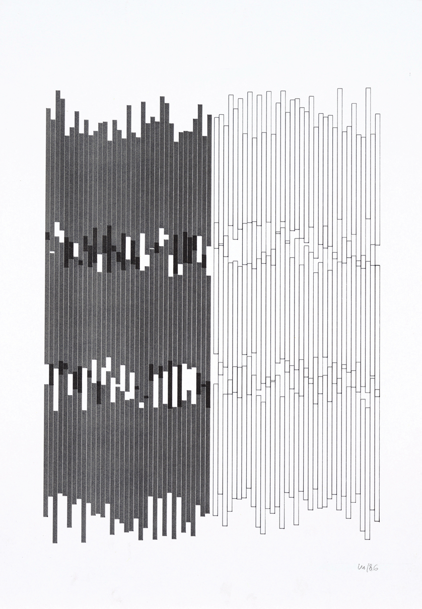
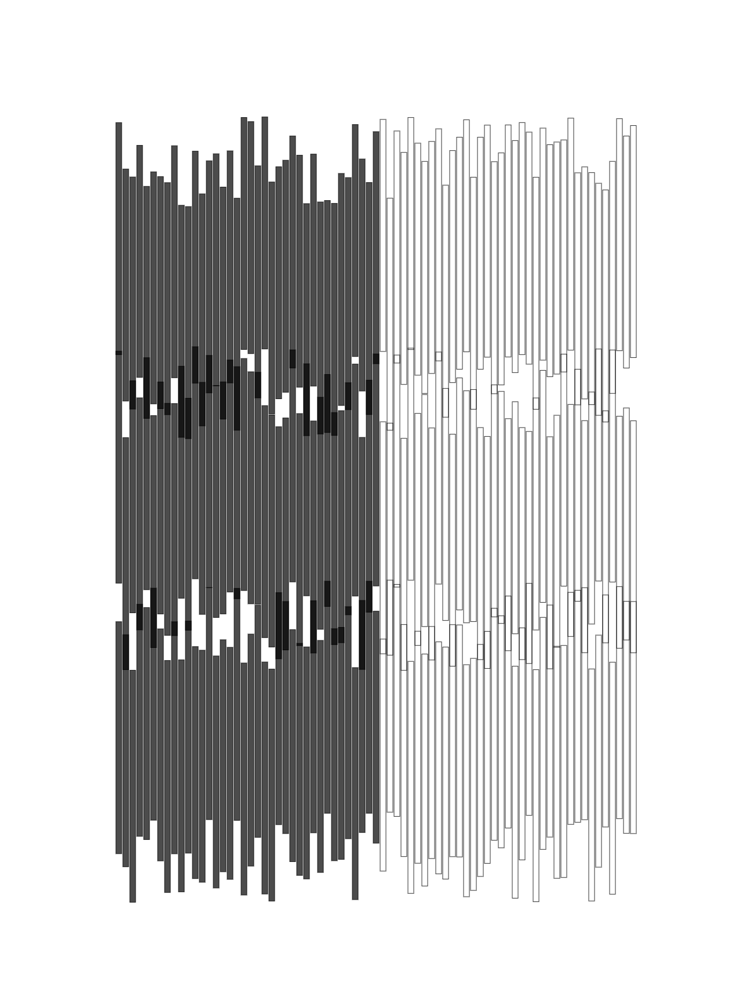

# SFPC_Fall_21
## Week 1 - Vera Molnar

### Original  
Vera Molnar, *Series Gothique*, plotter drawing, ink on paper, 38 x 29 cm, 1986  
  
* * *  
### Recreation  
Jenna Murphy, *Recreating Vera Molnar Series Gothique*, created with p5.js, October 2021  
  
* * *  
### Process
Work was recreated using p5.js. Three rows of rectangles were created with a for loop. An If/Else conditional statement was used to color in the left half of the shapes. Lastly, random() was used to adjust the y axis position allowing for the shape overlapping to occur. Transparency of the fill() was set to allow for the overlapping shapes to reveal the emerging black shape where they overlapped between rows.

[Link to Sketch](https://github.com/jennamurphymcad/SFPC_Fall_21/blob/main/week1/My%20Working%20Files/VeraMolnar/sketch.js "p5.js sketch")
